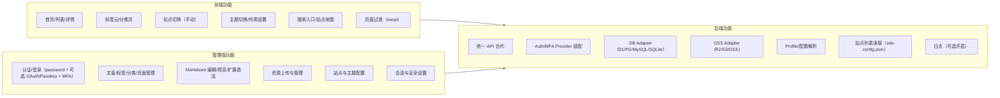
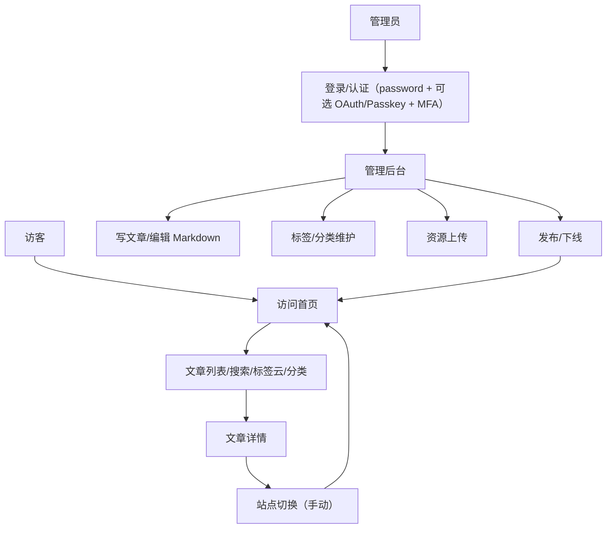

# 变更提案: multi-deploy-arch

## 元信息
```yaml
类型: 新功能
方案类型: overview
优先级: P1
状态: 草稿
创建: 2026-02-05
```

---

## 1. 需求

### 背景
个人博客项目，功能参考旧版（文章发布/浏览、站内搜索、个人内容展示：书单/电影/项目/旅行地图）。仅管理员后台，无评论与普通用户体系。希望在免费托管优先的前提下，兼容多种部署形态，并允许用户手动切换站点。

### 目标
- 输出兼容型架构与技术选型，支持 Workers/Edge/自部署 运行时与 D1/Postgres/MySQL/SQLite 任意组合（受平台能力约束）
- 给出统一 API 与数据访问抽象层设计，屏蔽数据库与存储差异
- 明确前端多平台部署与“手动站点切换”实现方式
- 给出开发结构（仓库组织、模块边界、配置策略）
- 指出主要风险与应对建议

### 约束条件
```yaml
时间约束: 不关注周期，优先完整性与可扩展性
性能约束: 手动切换与配置加载不影响首屏体验
兼容性约束: 多前端平台 + 多后端运行时 + 多数据库
业务约束: 个人博客；仅管理员后台；无评论与普通用户体系
```

### 验收标准
- [ ] 输出兼容型架构总览（含运行时-数据库-存储组合矩阵）
- [ ] 给出前端多平台部署结构与手动切换方案
- [ ] 明确 DB/OSS/Auth 适配层策略与优先顺序
- [ ] 提供开发结构与模块边界说明
- [ ] 列出主要风险与应对建议

---

## 2. 方案

### 技术方案（兼容型）
- 前端：React 单一构建产物，多平台部署（Vercel/Netlify/腾讯 Pages/CF Pages 等）。提供站点选择 UI，站点列表来自静态配置文件（site-config.json），用户手动切换并保存偏好（localStorage/cookie）。
- API：统一 API 合约，后端按 Profile 切换实现。建议选择支持多运行时的轻量框架（例如 Hono/自研适配层），保持 Edge/Worker/VPS 可共用业务逻辑。
- 运行时：全平台 TypeScript（Workers/Edge/VPS），暂不使用 WASM。
- 运行时/数据库/存储不固定绑定，按部署时配置自由组合（受平台能力约束）。
- 运行时策略：可配置多个后端/数据库条目，前端按配置选择；不做跨库同步。
- 数据与存储：抽象 DB Adapter（覆盖 D1/Postgres/MySQL/SQLite）与 OSS Adapter（R2/S3/OSS），后端实例只读取自身配置。
- 认证：管理员登录支持可插拔主登录 Provider（默认 password；可选 Passkey/OAuth（微信/GitHub 等）/邮箱等），并支持可选 MFA Provider（TOTP/微信等）；鉴权与运行时无关。
- 配置：运行时/DB/OSS 由环境变量/绑定提供；站点列表由静态配置文件下发（site-config.json），默认不自动路由。

### 运行时-数据库-存储组合矩阵（非固定绑定）
| 运行时 | 可用数据库 | 可用存储 | 说明 |
|------|------|------|------|
| Workers | D1 / Postgres / MySQL / SQLite | R2 / S3 / OSS | 需符合平台连接能力；D1 仅在 CF，可选 Hyperdrive/HTTP 驱动 |
| Edge Functions | Postgres / MySQL / SQLite | S3 / OSS | 受运行时限制，建议使用 HTTP/代理驱动 |
| VPS/自部署（可选） | Postgres / MySQL / SQLite | S3 / OSS | 完整可控，用于自部署镜像 |

说明：
- 运行时与数据库不固定绑定，按部署时配置选择
- 可并行部署多个后端实例，前端按 site-config.json 选择
- 可配置多个数据库条目，但不做跨库同步

### 开发结构（建议）
```
/apps
  /web         # 公开站点
  /admin       # 管理后台
  /api         # 统一 API（Edge/Worker/VPS 适配）
/packages
  /core        # 领域模型与用例
  /adapters-db # DB 适配层（D1/Postgres/...）
  /adapters-oss# 存储适配层（R2/S3/OSS）
  /adapters-auth # Auth/MFA Providers（password/Passkey/OAuth/TOTP 等）
  /config      # 配置与 Profile 管理
  /shared      # 通用类型与工具
```

### 手动站点切换
- UI 提供站点列表（从静态配置文件 site-config.json 加载）
- 用户选择站点后保存偏好，后续访问优先使用该站点
- 可选：展示延迟信息（用户手动触发测速），不自动切换

### 登录与会话策略
- 主登录：默认 password；可选 Passkey/OAuth（微信/GitHub 等）/邮箱
- password 策略：不强制复杂度（个人使用），仅要求安全哈希存储
- 二次验证：可选 TOTP/微信等
- 多站点：每站点独立 token

### 前端 UI/功能规划（不含 API/代码）
- 主题切换：浅色/深色/跟随系统，记忆用户偏好
- 无感切换：使用 swup 进行页面过渡（文章/列表/标签页），保持 SEO 与可访问性
- 导航体验：固定导航 + 面包屑/目录（可选），支持搜索入口
- 内容呈现：文章目录、阅读进度、代码高亮、图片灯箱（可选）
- 站点地图：生成 sitemap/站点地图页，支持搜索引擎与站内导航
- 站点切换：站点列表弹层，显示描述/地区/可选延迟提示
- 性能体验：首屏静态渲染 + 过渡加载 skeleton（可选）
- 标签云与分类：标签云页、分类页与分类聚合展示
- 登录体验优化（可选）：统一登录入口 + 回跳体验

### 管理端 UI/功能规划（不含 API/代码）
- 认证与安全：默认 password；可选 Passkey/OAuth/邮箱；可选二次验证（TOTP/微信等）；会话管理
- 内容管理：文章/标签/分类/页面的列表、编辑、发布/草稿
- Markdown 编辑：支持扩展语法（插件/短代码），实时预览与目录生成
- 便捷操作：批量标签/分类、快速发布/下线、定时发布（可选）
- 资源管理：图片/附件上传、预览、删除
- 站点与配置：站点列表维护（若启用），默认站点与主题配置

### 运维与日志（可选）
- 日志默认关闭，支持按需开启（登录失败、内容发布、站点切换）

### 部署与发布（Active 快速部署）
- 方案A（前端原生）：Vercel/Netlify/CF Pages/腾讯 Pages 等平台 Git 集成自动构建发布
- 方案B（后端原生）：Workers/Edge 通过平台 CLI 或 GitHub Actions 一键部署（如 wrangler/平台 CLI）
- 方案C（自部署）：GitHub Actions 构建并推送 Docker 镜像（GHCR/Docker Hub），供自部署用户拉取运行
- 统一通过环境变量注入后端地址与前端允许域名（ALLOWED_ORIGINS / ADMIN_ORIGIN）
- 站点列表静态文件由前端平台发布（site-config.json）


### 兼容实现策略（统一功能、不同实现）
- 目标：对外功能一致，不区分数据库能力；内部使用“多步骤实现”保证兼容
- 原则：统一接口必须可用；性能差异可接受；结果一致
- 示例：
  - 搜索：高级库用全文检索；弱能力库用 LIKE/分词表模拟
  - Upsert：支持原生的使用原生；不支持的用“先查→再插/更新”
  - 复杂查询：支持窗口/JSON 的一次查询；不支持的拆多次查询再拼装

### 数据与存储抽象
- DB Adapter 提供统一接口（覆盖 D1/Postgres/MySQL/SQLite；Posts/Categories/Tags/Pages/Assets/Settings/AdminAccount/AdminAuthProvider/AdminMfaProvider）
- 运行时可配置多个 DB Provider（对应不同后端），前端按配置选择；不做跨库同步。
- 仅保证“公共 SQL 子集”能力，复杂查询需在适配层降级或拆分
- 迁移策略：按 Profile 生成可执行迁移脚本（D1/PG/MySQL/SQLite）

### 影响范围
```yaml
涉及模块:
  - 前端站点: 多平台部署与站点切换 UI
  - 管理端: 管理后台与登录
  - API: 统一接口层
  - 适配层: DB/OSS/Auth Adapter
  - 配置体系: Profile 切换与站点列表管理
预计变更文件: N/A（方案阶段）
```

### 风险评估
| 风险 | 等级 | 应对 |
|------|------|------|
| 免费额度或政策变化 | 中 | Profile 可切换，保留 VPS 方案 |
| 多供应商复杂度上升 | 中 | 统一 API + Adapter + 配置驱动 |
| D1 与 Postgres 能力差异 | 中 | DB Adapter 限制公共子集 |
| 手动切换导致体验不一致 | 低 | 提供默认站点与可选延迟提示 |
| Auth/MFA Provider 在不同运行时与第三方平台实现差异 | 中 | 统一认证服务接口与策略封装 |
| 多站点登录体验差异 | 低 | 每站点独立 token |

---

## 3. 技术设计（可选）

### 架构设计
```mermaid
flowchart TD
    U[访客/管理员浏览器] --> W[React 前端(多平台部署)]
    W --> S[站点选择器(手动切换)]
    W -->|API| G[统一 API 网关]
    G --> P{后端配置}
    P --> A[Workers + DB/OSS (配置)]
    P --> B[Edge Functions + DB/OSS (配置)]
    P --> C[Self-host + DB/OSS (配置)]
    G --> AD[Adapter层(DB/OSS/Auth)]
```

### 前后端功能图（Markdown）


### 用户流程图（Markdown）


### API 设计（高层）
公共端:
- GET /api/posts
- GET /api/posts/{slug}
- GET /api/tags
- GET /api/pages/{slug}
- GET /api/search?q=...
- GET /site-config.json（静态配置）

管理端:
- GET /api/admin/auth/providers
- POST /api/admin/auth/enroll
- POST /api/admin/auth/challenge
- POST /api/admin/auth/verify
- POST /api/admin/auth/disable
- GET /api/admin/mfa/providers
- POST /api/admin/mfa/enroll
- POST /api/admin/mfa/challenge
- POST /api/admin/mfa/verify
- POST /api/admin/mfa/disable
- POST/PUT/DELETE /api/admin/posts
- POST/PUT/DELETE /api/admin/tags
- POST/PUT/DELETE /api/admin/pages
- POST /api/admin/assets/upload
- GET/PUT /api/admin/settings

### 数据模型（示意）
| 实体 | 关键字段 | 说明 |
|------|------|------|
| Post | id, slug, title, content, tags, status, publishedAt, categoryId | 文章（单分类） |
| Category | id, name, slug | 分类（单分类） |
| Tag | id, name, slug | 标签 |
| Page | id, slug, title, content | 独立页面 |
| Asset | id, url, type, size | 资源 |
| Setting | id, key, value | 站点配置 |
| AdminAccount | id | 管理员账户 |
| AdminAuthProvider | id, adminId, provider, config, enabled | 主登录方式（默认 password；可选 Passkey/OAuth/邮箱） |
| AdminMfaProvider | id, adminId, provider, config, enabled | 二次验证（TOTP/微信等） |

---

## 4. 核心场景

### 场景: 访客浏览文章
**模块**: 前端站点 + API
**条件**: 站点可用
**行为**: 浏览列表/详情，筛选标签
**结果**: 正常展示文章内容

### 场景: 管理员登录后台
**模块**: 管理端 + Auth Adapter
**条件**: 管理员发起登录
**行为**: 主登录 Provider 验证（可选 MFA Provider 二次验证）
**结果**: 进入管理后台

### 场景: 手动切换站点
**模块**: 站点选择器
**条件**: 多站点部署完成
**行为**: 用户选择站点并保存偏好
**结果**: 后续访问使用选定站点

---

## 5. 技术决策

### multi-deploy-arch#D001: 采用多 Profile 兼容架构（不设主推）
**日期**: 2026-02-05
**状态**: ✅采纳
**背景**: 需要同时支持免费托管与 VPS，避免单一平台绑定
**选项分析**:
| 选项 | 优点 | 缺点 |
|------|------|------|
| A: 单一平台方案 | 实现简单 | 迁移与额度风险高 |
| B: 多 Profile + 适配层 | 兼容性强 | 复杂度上升 |
**决策**: 选择方案B
**理由**: 满足“多平台并存 + 可迁移”目标
**影响**: 影响 API 设计与配置体系

### multi-deploy-arch#D002: 站点切换采用“手动选择 + 可选延迟提示”
**日期**: 2026-02-05
**状态**: ✅采纳
**背景**: 用户希望可控切换，不强制自动路由
**选项分析**:
| 选项 | 优点 | 缺点 |
|------|------|------|
| A: 边缘自动调度 | 无感切换 | 成本与复杂度高 |
| B: 前端手动切换 | 简单可控 | 体验依赖用户选择 |
**决策**: 选择方案B
**理由**: 与需求一致，成本更低
**影响**: 前端需增加站点选择 UI

### multi-deploy-arch#D003: DB 适配覆盖 D1/Postgres/MySQL/SQLite（全量多库）
**日期**: 2026-02-05
**状态**: ✅采纳
**背景**: 需要长期可迁移与多运行时兼容，同时不确定最终数据库落点
**选项分析**:
| 选项 | 优点 | 缺点 |
|------|------|------|
| A: 先做全量多库 | 覆盖广，迁移弹性强 | 复杂度与测试成本高 |
| B: 先做 D1 + Postgres | 实施更快 | 其它库延后 |
**决策**: 选择方案A
**理由**: 以兼容性优先，接受复杂度成本
**影响**: 适配层与测试矩阵增大，需要更严格抽象

### multi-deploy-arch#D004: 配置驱动 Profile 与站点列表
**日期**: 2026-02-05
**状态**: ✅采纳
**背景**: 需要无需改代码即可切换部署形态与站点列表
**选项分析**:
| 选项 | 优点 | 缺点 |
|------|------|------|
| A: 硬编码切换 | 简单 | 不可扩展 |
| B: 配置驱动 | 灵活 | 需要配置管理 |
**决策**: 选择方案B
**理由**: 更符合“可扩展”目标
**影响**: 需要统一配置与校验机制

---

### multi-deploy-arch#D005: 全平台 TypeScript，暂不引入 WASM
**日期**: 2026-02-05
**状态**: ✅采纳
**背景**: 博客数据处理量小，优先简化开发与维护
**选项分析**:
| 选项 | 优点 | 缺点 |
|------|------|------|
| A: 全平台 TypeScript | 兼容性强、维护成本低 | 极致性能有限 |
| B: Workers 使用 WASM | 性能更好 | 双实现、复杂度高 |
**决策**: 选择方案A
**理由**: 符合当前规模与成本优先
**影响**: 不需要 WASM 构建链路与双实现

### multi-deploy-arch#D006: 运行时/数据库/存储任意组合（受平台约束）
**日期**: 2026-02-05
**状态**: ✅采纳
**背景**: 不希望固定搭配，允许 Workers/Edge/VPS 配任意数据库与存储
**选项分析**:
| 选项 | 优点 | 缺点 |
|------|------|------|
| A: 固定绑定 | 简单 | 迁移与扩展受限 |
| B: 任意组合 | 灵活可切换 | 需处理平台限制 |
**决策**: 选择方案B
**理由**: 符合“独立部署/多部署并行”的诉求
**影响**: 配置需显式声明运行时/DB/OSS 组合

### multi-deploy-arch#D007: 多前端共享同一内容池（默认），多库条目仅作切换
**日期**: 2026-02-05
**状态**: ✅采纳
**背景**: 多平台前端需要一致内容，同时允许配置多个数据库条目
**选项分析**:
| 选项 | 优点 | 缺点 |
|------|------|------|
| A: 共享单库（默认） | 内容一致、管理简单 | 容灾与隔离弱 |
| B: 多库并行 | 可隔离 | 成本与一致性风险高 |
**决策**: 选择方案A
**理由**: 个人博客场景优先一致性与简化运维
**影响**: 多库仅作切换，不做跨库同步

### multi-deploy-arch#D008: 站点列表采用静态配置文件下发
**日期**: 2026-02-05
**状态**: ✅采纳
**背景**: 简化系统复杂度，避免新增配置服务
**选项分析**:
| 选项 | 优点 | 缺点 |
|------|------|------|
| A: 静态配置文件 | 简单可靠 | 更新需重新部署前端 |
| B: 配置 API | 动态更新 | 增加服务与运维复杂度 |
**决策**: 选择方案A
**理由**: 贴合当前规模，降低复杂度
**影响**: 站点列表更新需重建前端

### multi-deploy-arch#D009: GitHub Actions 一键构建并推送 Docker 镜像
**日期**: 2026-02-05
**状态**: ✅采纳
**背景**: 为自部署用户提供快速交付方式
**选项分析**:
| 选项 | 优点 | 缺点 |
|------|------|------|
| A: 手动构建 | 简单 | 重复劳动 |
| B: CI/CD 自动构建 | 一键部署 | 需要配置密钥 |
**决策**: 选择方案B
**理由**: 提升可用性，降低部署门槛
**影响**: 需维护 GitHub Actions 流程与镜像仓库

### multi-deploy-arch#D010: 边缘函数按“完整后端”设计，但遵守资源限制
**日期**: 2026-02-05
**状态**: ✅采纳
**背景**: 需要独立部署也能运行
**选项分析**:
| 选项 | 优点 | 缺点 |
|------|------|------|
| A: 模块化小函数 | 轻量 | 组织复杂 |
| B: 完整后端 | 结构清晰 | 需控制耗时与资源 |
**决策**: 选择方案B
**理由**: 贴合“完整后端”诉求
**影响**: 需确保逻辑轻量、避免重计算

### multi-deploy-arch#D011: Active 快速部署覆盖平台原生部署 + Docker
**日期**: 2026-02-05
**状态**: ✅采纳
**背景**: 降低部署门槛，同时兼顾平台原生发布与自部署
**选项分析**:
| 选项 | 优点 | 缺点 |
|------|------|------|
| A: 仅 Docker | 自部署方便 | 平台原生发布不够友好 |
| B: 平台原生 + Docker | 覆盖全面 | 维护流程更复杂 |
**决策**: 选择方案B
**理由**: 兼顾多平台与自部署用户
**影响**: 需要维护多条发布路径

### multi-deploy-arch#D012: 统一功能接口，弱能力库用多步骤实现
**日期**: 2026-02-05
**状态**: ✅采纳
**背景**: 希望所有数据库都能提供相同功能，不对外暴露差异
**选项分析**:
| 选项 | 优点 | 缺点 |
|------|------|------|
| A: 以最低能力为准 | 简单稳定 | 功能受限 |
| B: 统一接口 + 多步骤兼容实现 | 功能完整 | 复杂度提升 |
**决策**: 选择方案B
**理由**: 兼顾体验与兼容性
**影响**: 适配层复杂度上升，需更多测试覆盖

### multi-deploy-arch#D013: 二次验证采用可插拔 MFA/身份提供方 Adapter
**日期**: 2026-02-05
**状态**: ✅采纳
**背景**: 希望像数据库一样便于新增/删除二次验证，并可能接入微信等第三方
**选项分析**:
| 选项 | 优点 | 缺点 |
|------|------|------|
| A: 固定 TOTP | 实现简单 | 扩展性差，无法接入微信等 |
| B: 可插拔 Provider | 易扩展，可按需增删 | 设计与测试成本更高 |
**决策**: 选择方案B
**理由**: 满足“可扩展 + 易增删”的需求
**影响**: Auth Adapter 需支持 Provider 注册/配置与统一挑战/验证流程

### multi-deploy-arch#D014: 主登录方式采用可插拔 Auth Provider
**日期**: 2026-02-05
**状态**: ✅采纳
**背景**: 需要同时支持多种登录方式，并允许新增/删除（如 Passkey/微信/邮箱）
**选项分析**:
| 选项 | 优点 | 缺点 |
|------|------|------|
| A: 固定单一登录方式 | 实现简单 | 扩展性差 |
| B: 可插拔 Auth Provider | 易扩展，可按需增删 | 设计与测试成本更高 |
**决策**: 选择方案B
**理由**: 满足“多登录方式 + 易增删”的需求
**影响**: Auth Adapter 需支持多 Provider 的绑定/挑战/验证

### multi-deploy-arch#D015: 主登录默认 password，其他方式可选启用
**日期**: 2026-02-05
**状态**: ✅采纳
**背景**: 需要最小可用登录方案，同时保留扩展空间
**选项分析**:
| 选项 | 优点 | 缺点 |
|------|------|------|
| A: 默认 password | 简单直观、成本低 | 安全性需更严格配置 |
| B: 默认 Passkey | 安全性更高 | 兼容性与接入成本较高 |
**决策**: 选择方案A
**理由**: 与“个人博客 + 快速上手”一致
**影响**: 仅要求安全哈希存储，不强制复杂度策略

## 附录
- 数据库字段设计: db-schema.md
- 功能与函数清单: function-spec.md

